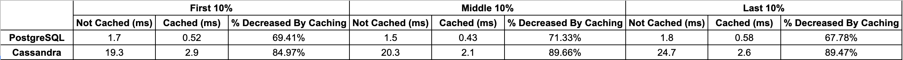

# GoOutdoor

Welcome to GoOutdoor! GoOutdoor is an open-source e-commerce platform using service oriented architecture(SOA), and this projest is specifically for the related items module in an application. This project is based on a legacy code base, which had a fully working front end with a minimum of back end. My work was focused on the back end side with database/server directories. If you're interested in my front end work, you can take a look at [Souperhost Review Section](https://github.com/souperhost-3000/service-chris)!

## Related Projects

  - [GoOutdoor Display Module](https://github.com/The-10-000-RPS-Club/display-service.git)
  - [GoOutdoor Q&A Module](https://github.com/The-10-000-RPS-Club/service-jacki.git)
  - [GoOutdoor Reviews Module](https://github.com/The-10-000-RPS-Club/reviews-joe.git)

## Table of Contents

1. [Database](#database)
1. [Server Optimization and Scaling the Architecture](#server-optimization-and-scaling-the-architecture)
1. [Result](#result)

## Database
I needed to decide what database to use for my module. So, I first chose widely used SQL database and NoSQL database, PostgreSQL and Cassandra DB. Then, I benchmarked two databases by obtaining query time data in three sections of my data set, the first 10%, the middle 10%, and the last 10% of my data set. In each section, I performed 4 queries spread out across the section. 

<h6 align="center"> Table 1. Database Benchmark </h6>

As can be seen on the Table 1 above, the query time of PostgreSQL was faster than the query time of Cassandra for cached and non-cached data. Also, because of Postgres’s strong developer community, PostgreSQL was a better fit for my specific use case.

## Server Optimization and Scaling the Architecture

## Result
After benchmarking databases and optimizing the application’s architecture, I could get a 300% increase in throughput. This means more concurrent users can interact with the application without being angry because of wait time, and more happy users will result in an increase in a company’s revenue. Overall, I was happy that I could overcome the challenge and meet the goal.
